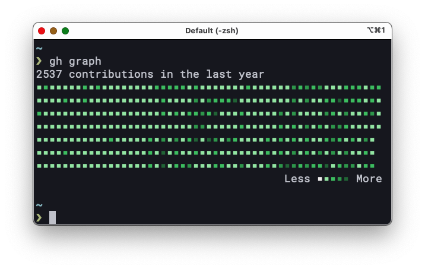

# gh-graph

GitHub contribution graph in your terminal.



This command calls [kawarimidoll/deno-github-contributions-api](https://github.com/kawarimidoll/deno-github-contributions-api).

## Usage

Install [GitHub cli](https://github.com/cli/cli) and run `gh auth login` to login to GitHub.

```
❯ gh extension install kawarimidoll/gh-graph
❯ gh graph
```
